# InsureHub — High-Level Design Document

**Version:** 1.0  
**Date:** 7 March 2026  
**Author:** Development Team  
**Status:** Final

---

## Table of Contents

1. [Introduction](#1-introduction)
2. [System Overview](#2-system-overview)
3. [Architecture Design](#3-architecture-design)
4. [Module Federation Configuration](#4-module-federation-configuration)
5. [Component Architecture](#5-component-architecture)
6. [Cross-MFE Communication](#6-cross-mfe-communication)
7. [Data Layer & Storage](#7-data-layer--storage)
8. [Web Worker — Asynchronous Computation](#8-web-worker--asynchronous-computation)
9. [Shared Library Design](#9-shared-library-design)
10. [Styling Architecture](#10-styling-architecture)
11. [Routing & Navigation](#11-routing--navigation)
12. [Error Handling & Resilience](#12-error-handling--resilience)
13. [Security Considerations](#13-security-considerations)
14. [Performance Considerations](#14-performance-considerations)
15. [Deployment Architecture](#15-deployment-architecture)
16. [Future Enhancements](#16-future-enhancements)

---

## 1. Introduction

### 1.1 Purpose

This document provides a comprehensive High-Level Design (HLD) for **InsureHub**, a micro-frontend (MFE) based insurance management application. It covers the system architecture, cross-cutting concerns, data flow, technology decisions, and deployment strategy.

### 1.2 Scope

InsureHub enables users to:
- View and manage insurance policies (Health, Life, Auto, Home, Travel)
- Perform premium payments with multiple payment methods
- View payment history and transaction records
- Receive real-time premium analysis computed off the main thread

### 1.3 Design Goals

| Goal | Description |
|------|-------------|
| **Independent Deployability** | Each MFE can be built, tested, and deployed independently |
| **Technology Consistency** | All MFEs use Angular 17 with standalone components for team alignment |
| **Runtime Composition** | MFEs are loaded at runtime via Webpack Module Federation, not build-time |
| **Shared State** | Cross-MFE data sharing through browser-native APIs (localStorage, CustomEvent) |
| **Performance** | Heavy computations offloaded to Web Workers; lazy loading for MFE bundles |
| **Professional UX** | Clean, light-themed corporate interface with Material Icons |

### 1.4 Constraints & Assumptions

- No backend server — all data persisted in `localStorage`
- Single browser tab assumed (no cross-tab sync required)
- Remote MFE servers must be running before the Container host
- All MFEs share the same Angular version to ensure singleton compatibility

---

## 2. System Overview

### 2.1 High-Level Architecture

The application is composed in the browser at runtime, but the runtime behavior is easiest to understand as three layers: delivery endpoints, in-browser application composition, and shared browser platform services.

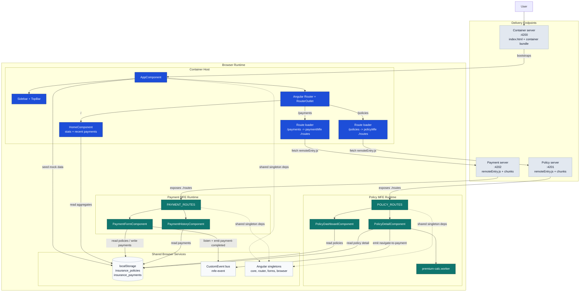

**Diagram Notes:**
- `Delivery Endpoints` shows where bundles come from; only the Container is opened directly by the user.
- `Browser Runtime` shows which parts are local to the Container versus loaded remotely into the Container router.
- `localStorage` is the durable client-side store; `CustomEvent` is the transient in-memory event channel.
- Angular framework packages are shared as Module Federation singletons to avoid duplicate runtimes.
- The Web Worker belongs only to the Policy MFE and is isolated from the Container and Payment MFE.

### 2.2 Application Breakdown

| Application | Role | Port | Description |
|-------------|------|------|-------------|
| **Container** | Host / Container | 4200 | Provides the application chrome (sidebar, top bar, layout), owns the root router, and renders the Home Dashboard locally. |
| **Policy MFE** | Remote | 4201 | Manages policy listing and detail flows. Exposes `POLICY_ROUTES` via Module Federation and runs premium analytics in a Web Worker. |
| **Payment MFE** | Remote | 4202 | Handles premium payment entry and payment history. Exposes `PAYMENT_ROUTES` via Module Federation and participates in cross-MFE payment handoff via browser events. |

---

## 3. Architecture Design

### 3.1 Architectural Pattern

InsureHub follows the **Micro-Frontend architecture** pattern, where a single-page application is composed of multiple independently developed, built, and deployable frontend modules. The specific implementation uses **Webpack Module Federation** for runtime composition.

### 3.2 Architectural Decisions

| Decision | Choice | Rationale |
|----------|--------|-----------|
| MFE Framework | Webpack Module Federation | Industry standard for Angular MFEs; enables runtime loading without iframes |
| Component Model | Angular Standalone Components | Eliminates NgModule boilerplate; cleaner dependency management |
| Styling | SCSS with shared design tokens | Pre-processor features (variables, mixins, nesting) with consistent design system |
| State Management | localStorage + Custom Events | No backend requirement; simple, browser-native, works across MFE boundaries |
| Async Computation | Web Worker | Premium calculation offloaded from main thread to prevent UI jank |
| Icons | Material Icons Outlined | Professional, consistent icon set via Google CDN |
| Build Tooling | ngx-build-plus | Extends Angular CLI with custom Webpack config support |

### 3.3 Component Interaction Diagram

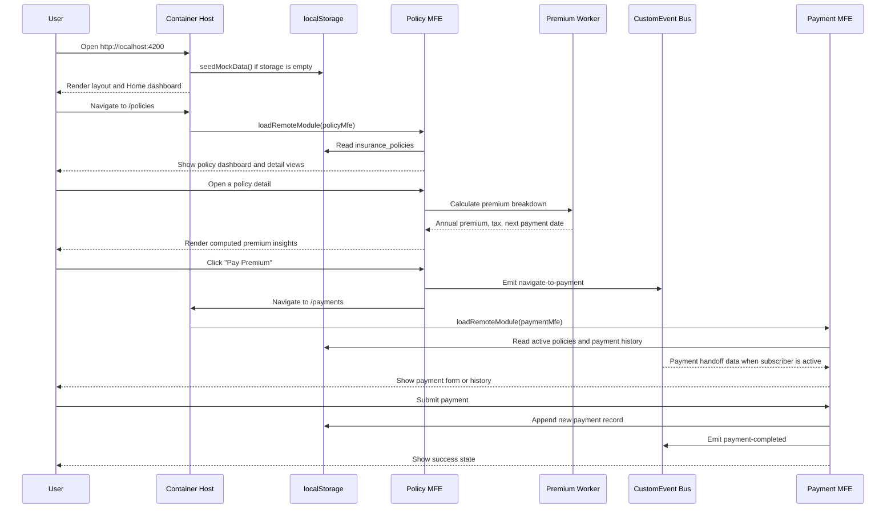

---

## 4. Module Federation Configuration

### 4.1 How Module Federation Works

Module Federation is a Webpack 5 feature that allows multiple independently built applications to share code at runtime. Each remote application exposes specific modules, and the host application consumes them dynamically.

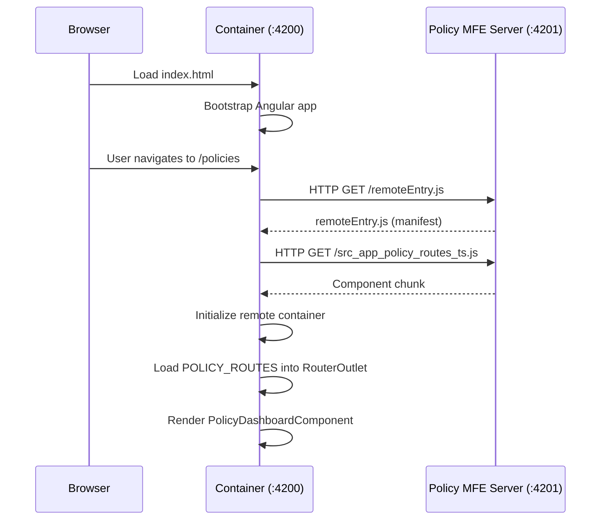

### 4.2 Host Configuration (Container)

```javascript
// container-app/webpack.config.js
const policyRemoteEntry =
  process.env.POLICY_MFE_REMOTE_ENTRY || 'http://localhost:4201/remoteEntry.js';
const paymentRemoteEntry =
  process.env.PAYMENT_MFE_REMOTE_ENTRY || 'http://localhost:4202/remoteEntry.js';

new ModuleFederationPlugin({
  remotes: {
    policyMfe:  `policyMfe@${policyRemoteEntry}`,
    paymentMfe: `paymentMfe@${paymentRemoteEntry}`,
  },
  shared: {
    '@angular/core':             { singleton: true, strictVersion: true },
    '@angular/common':           { singleton: true, strictVersion: true },
    '@angular/router':           { singleton: true, strictVersion: true },
    '@angular/forms':            { singleton: true, strictVersion: true },
    '@angular/platform-browser': { singleton: true, strictVersion: true },
  },
})
```

**Key Points:**
- `remotes` maps logical names to remote entry URLs
- Remote entry URLs can be injected from environment variables for production deployments
- `singleton: true` ensures only one instance of Angular is loaded, regardless of how many MFEs are active
- `strictVersion: true` prevents version mismatches from silently loading duplicate modules

### 4.3 Remote Configuration (Policy MFE)

```javascript
// policy-mfe/webpack.config.js
new ModuleFederationPlugin({
  name: 'policyMfe',
  filename: 'remoteEntry.js',
  exposes: {
    './routes': './src/app/policy.routes.ts',
  },
  shared: { /* same as host */ },
})
```

**Key Points:**
- `name` must match the remote name used in the host's `remotes` config
- `filename` is the manifest file the host fetches first
- `exposes` maps module aliases to actual file paths

### 4.4 Route-Level Integration

```typescript
// container-app/src/app/app.routes.ts
import { REMOTE_CONFIG } from './remote-config';

{
  path: 'policies',
  loadChildren: () =>
    loadRemoteModule({
      type: 'script',
      remoteName: REMOTE_CONFIG.policyMfe.remoteName,
      remoteEntry: REMOTE_CONFIG.policyMfe.remoteEntry,
      exposedModule: REMOTE_CONFIG.policyMfe.exposedModule,
    }).then(m => m.POLICY_ROUTES),
}
```

The `type: 'script'` loading strategy is used because `type: 'module'` causes `container.init is not a function` errors with the standard Angular webpack output configuration. The `REMOTE_CONFIG` file is generated at build time from environment variables for Vercel and falls back to localhost during local development.

---

## 5. Component Architecture

### 5.1 Container Application

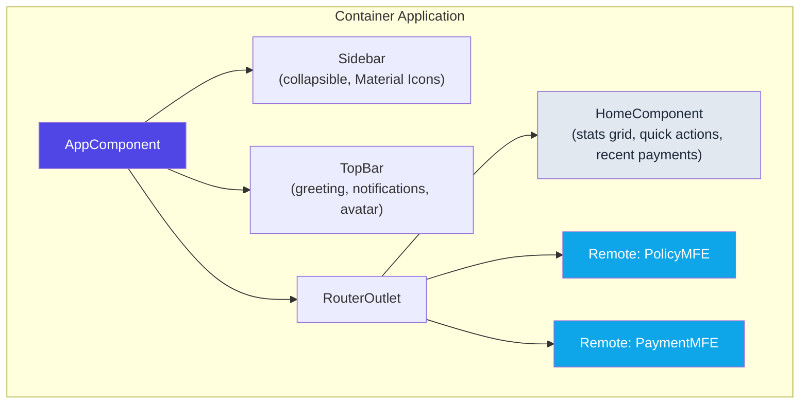

**AppComponent** responsibilities:
- Seeds mock data on initialization via `seedMockData()`
- Manages sidebar collapsed/expanded state
- Provides the application layout container (sidebar + topbar + content area)

**HomeComponent** responsibilities:
- Reads policies and payments from `StorageService`
- Computes aggregate statistics (total policies, active count, monthly premium, total paid)
- Displays recent payments in a tabular format
- Provides quick action navigation cards

### 5.2 Policy MFE

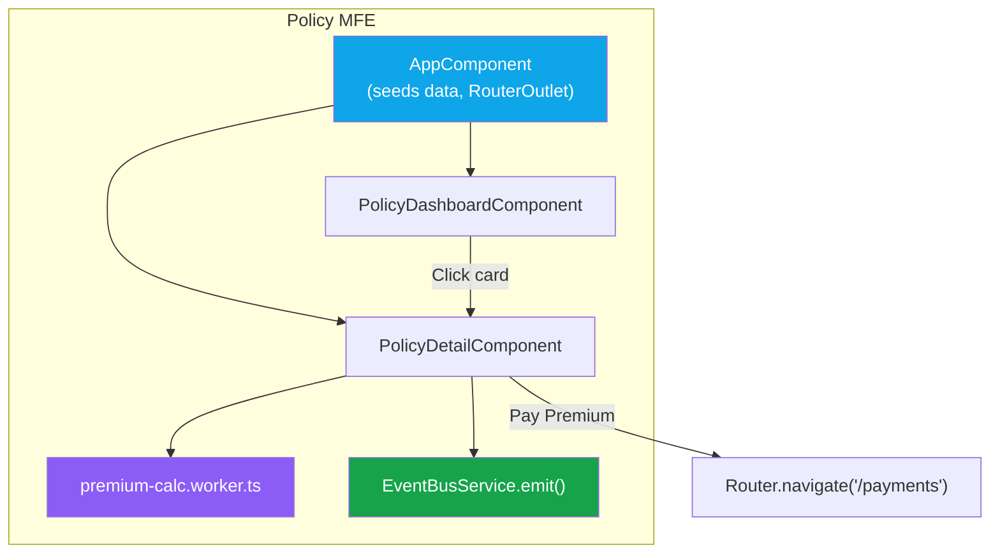

**PolicyDashboardComponent:**
- Loads all policies from `StorageService`
- Provides filter tabs (All / Active / Expired / Pending)
- Renders policy cards in a responsive grid
- Maps policy types to Material Icons (`local_hospital`, `shield`, `directions_car`, `home`, `flight`)

**PolicyDetailComponent:**
- Loads a single policy by route parameter `:id`
- Instantiates a Web Worker for premium calculation
- Has a try/catch fallback to inline calculation for cross-origin scenarios
- Emits `navigate-to-payment` event via `EventBusService` when user clicks "Pay Premium"

### 5.3 Payment MFE

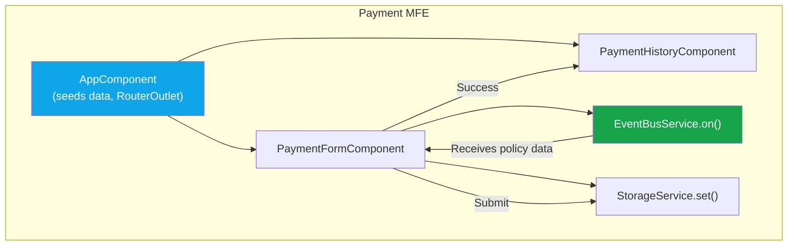

**PaymentFormComponent:**
- Subscribes to `navigate-to-payment` events from Policy MFE on init
- Pre-fills policy selection and amount when cross-MFE data arrives
- Supports 4 payment methods: Credit Card, Debit Card, Net Banking, UPI
- Conditionally shows card fields (number, expiry, CVV) or UPI ID based on selection
- Simulates 2-second payment processing delay
- Saves new `Payment` object to localStorage
- Emits `payment-completed` event on success

**PaymentHistoryComponent:**
- Reads all payments from `StorageService`
- Computes total paid aggregate
- Renders transaction cards with method icons, amounts, dates, and status badges

---

## 6. Cross-MFE Communication

### 6.1 Design Decision

Cross-MFE communication uses `window.CustomEvent` — a browser-native API that works across any framework. This avoids coupling MFEs to a specific state management library and keeps the communication simple and debuggable.

### 6.2 EventBusService Architecture

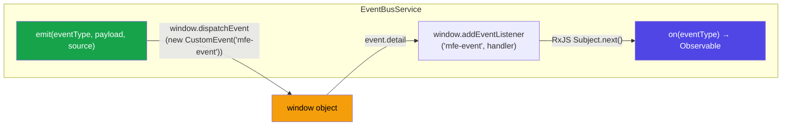

### 6.3 Event Types

| Event | Source | Consumer | Payload |
|-------|--------|----------|---------|
| `navigate-to-payment` | Policy MFE | Payment MFE | `{ policyId, policyNumber, amount, policyType }` |
| `payment-completed` | Payment MFE | Container / Policy MFE | `{ transactionId, policyId, amount, status }` |
| `policy-selected` | Policy MFE | Any listener | `{ policyId, policyNumber }` |

### 6.4 Complete Communication Sequence

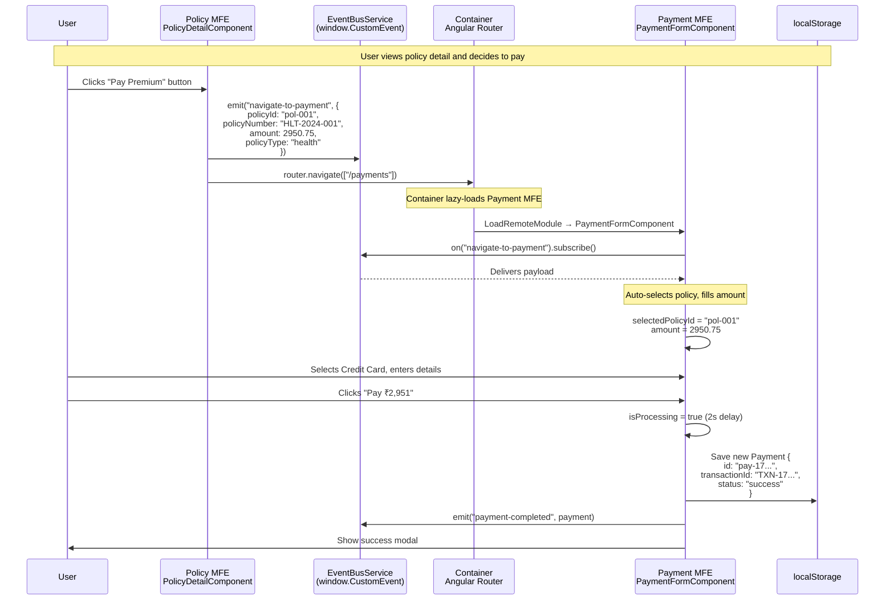

---

## 7. Data Layer & Storage

### 7.1 Storage Strategy

All application data is persisted in the browser's `localStorage` via a shared `StorageService`. This approach was chosen because:

- No backend dependency required
- Data persists across page refreshes
- Shared across all MFEs running on the same origin
- Simple, synchronous API

### 7.2 Storage Keys

| Key | Type | Written By | Read By |
|-----|------|-----------|---------|
| `insurance_policies` | `Policy[]` | `seedMockData()` | Container Home, Policy Dashboard, Policy Detail, Payment Form |
| `insurance_payments` | `Payment[]` | `seedMockData()`, Payment Form | Container Home, Payment History |

### 7.3 Data Models

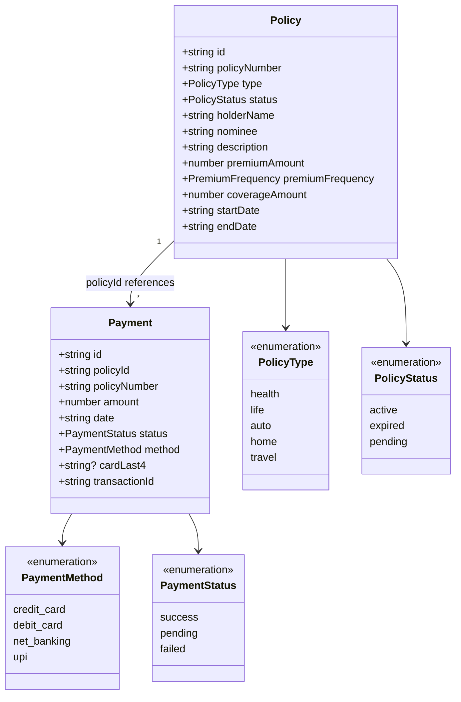

### 7.4 Mock Data Seeding

The `seedMockData()` function runs in every app's `AppComponent.ngOnInit()`. It uses an **idempotent** pattern:

```typescript
export function seedMockData(): void {
  const storage = new StorageService();
  if (!storage.has('insurance_policies')) {
    storage.set('insurance_policies', MOCK_POLICIES);  // 6 policies
  }
  if (!storage.has('insurance_payments')) {
    storage.set('insurance_payments', MOCK_PAYMENTS);  // 5 payments
  }
}
```

This ensures:
- First load in any app seeds the data
- Subsequent loads preserve user-generated data (e.g., new payments)
- Works identically whether accessed via Container or standalone

---

## 8. Web Worker — Asynchronous Computation

### 8.1 Purpose

The premium calculation involves multiple derived metrics (discount tiers, tax, projections). While not computationally expensive at current scale, using a Web Worker demonstrates the pattern for offloading intensive calculations from the main thread, which is critical for:

- Large batch calculations
- Real-time re-computation as parameters change
- Maintaining 60fps UI responsiveness

### 8.2 Architecture

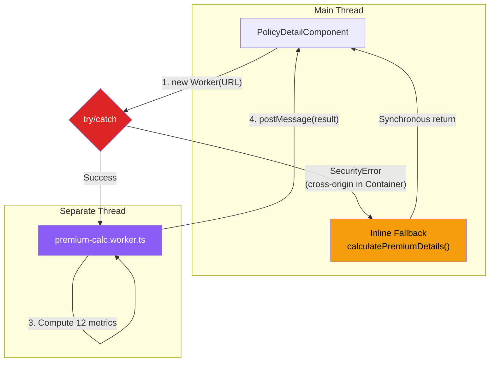

### 8.3 Input/Output Contract

**Input:**

| Field | Type | Description |
|-------|------|-------------|
| `premiumAmount` | number | Per-period premium |
| `premiumFrequency` | string | monthly / quarterly / semi-annual / annual |
| `coverageAmount` | number | Total coverage value |
| `policyType` | string | health / life / auto / home / travel |
| `startDate` | string | Policy start date (ISO) |
| `endDate` | string | Policy end date (ISO) |

**Output (12 computed metrics):**

| Metric | Formula / Logic |
|--------|----------------|
| Annual Premium | `premiumAmount × frequencyMultiplier` |
| Monthly Equivalent | `annualPremium ÷ 12` |
| Total Paid to Date | `paymentsMade × premiumAmount` |
| Remaining Payments | `totalPayments − paymentsMade` |
| Next Payment Date | Computed from start + payment intervals |
| Discount Tier | Standard (<₹10K) / Silver / Gold / Platinum (≥₹50K) |
| Discount Percentage | 0% / 5% / 10% / 15% |
| Effective Premium | `premiumAmount × (1 − discount%)` |
| Tax Amount (GST 18%) | `effectivePremium × 0.18` |
| Total with Tax | `effectivePremium + taxAmount` |
| Coverage Ratio | `coverageAmount ÷ annualPremium` |
| Projected Total Cost | `totalPayments × totalWithTax` |

### 8.4 Cross-Origin Fallback

When the Policy MFE runs inside the Container (different origin), the browser blocks Web Worker instantiation with a `SecurityError`. The component handles this gracefully:

```
try {
  worker = new Worker(new URL(...));
  worker.onerror = () => fallbackToInline();
} catch (e) {
  fallbackToInline();  // Same calculation, main thread
}
```

The user sees identical results regardless of which path executes.

---

## 9. Shared Library Design

### 9.1 Structure

```
shared/
├── models/
│   ├── policy.model.ts       # Policy interface, PolicyType, status labels, icons
│   ├── payment.model.ts      # Payment interface, PaymentMethod, status colors
│   └── index.ts              # Barrel export
├── services/
│   ├── storage.service.ts    # Generic localStorage wrapper
│   ├── event-bus.service.ts  # Cross-MFE CustomEvent bridge with RxJS
│   └── index.ts              # Barrel export
├── data/
│   └── mock-data.ts          # Mock data arrays + seedMockData()
└── styles/
    ├── _variables.scss        # Design tokens
    └── _mixins.scss           # Reusable SCSS mixins
```

### 9.2 Distribution Strategy

The `shared/` directory is **copied** into each project's `src/app/shared/` directory. This was chosen over symlinks because:

| Approach | Pros | Cons |
|----------|------|------|
| **Symlinks** | Single source of truth | TypeScript compilation fails — files outside project root aren't included in `tsconfig` |
| **npm workspace** | Proper package management | Overkill for 3 services and 2 models |
| **Copy** ✅ | Works with Angular CLI, simple | Must re-copy on changes |

For a production setup, the shared code would be published as a private npm package (`@insurehub/shared`) and installed as a dependency in each project.

### 9.3 StorageService API

```typescript
class StorageService {
  get<T>(key: string): T | null          // Parse JSON from localStorage
  set<T>(key: string, value: T): void    // Stringify and save
  remove(key: string): void              // Delete key
  has(key: string): boolean              // Check existence
}
```

### 9.4 EventBusService API

```typescript
class EventBusService {
  emit<T>(eventType: string, payload: T, source: string): void
  // Dispatches: window.dispatchEvent(new CustomEvent('mfe-event', { detail }))

  on<T>(eventType: string): Observable<T>
  // Returns: filtered RxJS Observable from internal Subject
}
```

---

## 10. Styling Architecture

### 10.1 Design System

The application uses a token-based design system implemented in SCSS:

**Color Palette (Light Professional Theme):**

| Token | Value | Usage |
|-------|-------|-------|
| `$bg-primary` | `#f8f9fb` | Page background |
| `$bg-secondary` | `#ffffff` | Cards, sidebar |
| `$accent-primary` | `#4f46e5` | Buttons, active states, links |
| `$accent-secondary` | `#0ea5e9` | Secondary highlights |
| `$text-primary` | `#1e293b` | Headings, body text |
| `$text-secondary` | `#475569` | Descriptions |
| `$text-muted` | `#94a3b8` | Labels, captions |
| `$border-color` | `#e2e8f0` | Card borders, dividers |
| `$success` | `#16a34a` | Success states |
| `$danger` | `#dc2626` | Error states |

**Typography:**

| Token | Value |
|-------|-------|
| Font Family | Inter (Google Fonts CDN) |
| Size Scale | 0.75rem → 1.875rem (7 stops) |
| Weight Scale | 400 / 500 / 600 / 700 |

### 10.2 Reusable Mixins

| Mixin | Purpose |
|-------|---------|
| `@include card` | White card with border, shadow, hover effect |
| `@include button-primary` | Indigo filled button with hover state |
| `@include button-ghost` | Outlined secondary button |
| `@include input-field` | Styled input with focus ring |
| `@include page-container` | Consistent page padding and max-width |
| `@include section-title` | Section heading style |
| `@include gradient-text` | Indigo-to-cyan gradient text |
| `@include icon-box` | Icon container with background |

### 10.3 Style Ownership

Each component owns its styles via Angular's `styleUrl` (view encapsulation). Global styles are minimal — only base resets, font import, and scrollbar styling.

---

## 11. Routing & Navigation

### 11.1 Route Map

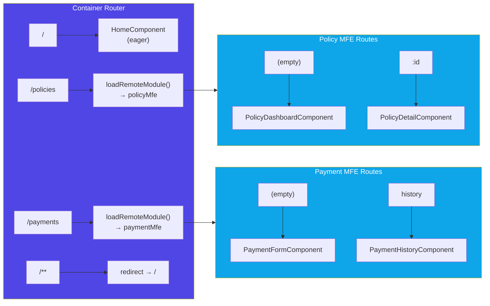

### 11.2 Full Route Table

| Full Path | App | Component | Load Type |
|-----------|-----|-----------|-----------|
| `/` | Container | `HomeComponent` | Eager |
| `/policies` | Policy MFE | `PolicyDashboardComponent` | Lazy (Module Federation) |
| `/policies/:id` | Policy MFE | `PolicyDetailComponent` | Lazy (Module Federation) |
| `/payments` | Payment MFE | `PaymentFormComponent` | Lazy (Module Federation) |
| `/payments/history` | Payment MFE | `PaymentHistoryComponent` | Lazy (Module Federation) |

### 11.3 Navigation Patterns

- **Sidebar navigation:** Uses Angular `routerLink` with `routerLinkActive` for visual feedback
- **Cross-MFE navigation:** Policy MFE calls `router.navigate(['/payments'])` which triggers the Container's lazy loading of Payment MFE
- **Back navigation:** Components use `router.navigate()` to parent routes

---

## 12. Error Handling & Resilience

### 12.1 Remote Loading Failures

If a remote MFE is unavailable (server down), `loadRemoteModule()` will throw an error. The Container's route definition uses Angular's lazy loading, which will show a blank content area. In production, this would be wrapped with an error boundary component showing a user-friendly message.

### 12.2 Web Worker Fallback

```
Worker instantiation
    ├── Success → Worker thread computes → postMessage result
    ├── onerror → Fallback to inline calculation on main thread
    └── SecurityError (catch) → Fallback to inline calculation on main thread
```

All three paths produce identical results. The UI shows a "Web Worker" badge only when the worker thread was actually used.

### 12.3 Storage Failures

`StorageService` methods are wrapped with try-catch. If `localStorage` is full or disabled:
- `get()` returns `null`
- `set()` silently fails
- UI shows empty states ("No policies found", "No payment history")

---

## 13. Security Considerations

| Concern | Mitigation |
|---------|-----------|
| **XSS via CustomEvent** | Event payloads are typed interfaces; no DOM injection from event data |
| **localStorage data tampering** | No sensitive data stored (no auth tokens, passwords); mock data only |
| **Cross-Origin Worker** | Fallback to inline calculation prevents SecurityError crashes |
| **Dependency pollution** | `singleton: true` in Module Federation prevents duplicate Angular instances |
| **Remote entry integrity** | In production, use subresource integrity (SRI) hashes on `remoteEntry.js` |

---

## 14. Performance Considerations

### 14.1 Bundle Sizes

| App | Initial Bundle | Remote Entry |
|-----|---------------|-------------|
| Container | ~178 KB | — |
| Policy MFE | ~203 KB | 29 KB |
| Payment MFE | ~204 KB | 30 KB |

### 14.2 Optimization Strategies

| Strategy | Implementation |
|----------|---------------|
| **Lazy Loading** | Remote MFEs loaded on-demand via route navigation, not at app startup |
| **Singleton Sharing** | Angular core shared across MFEs — loaded once, reused everywhere |
| **Web Worker** | Premium calculations don't block main thread rendering |
| **Component Encapsulation** | Each component loads its own styles, preventing unused CSS |
| **Animation Staggering** | Cards animate with incremental delay (`animationDelay: i * 0.04s`) for perceived performance |

### 14.3 Loading Sequence

```mermaid
gantt
    title Application Loading Timeline
    dateFormat X
    axisFormat %s

    section Container
    index.html + main.js          :0, 1
    Angular bootstrap             :1, 2
    Sidebar + TopBar render       :2, 3
    HomeComponent render          :3, 4

    section Policy MFE (on navigate)
    Fetch remoteEntry.js          :5, 6
    Fetch component chunk         :6, 7
    PolicyDashboard render        :7, 8

    section Web Worker (on policy click)
    Instantiate Worker            :9, 10
    Premium calculation           :10, 11
    Display results               :11, 12
```

---

## 15. Deployment Architecture

### 15.1 Local Development

```bash
# Terminal 1 — Policy MFE
cd policy-mfe && npm start       # → http://localhost:4201

# Terminal 2 — Payment MFE
cd payment-mfe && npm start      # → http://localhost:4202

# Terminal 3 — Container (start LAST)
cd container-app && npm start    # → http://localhost:4200
```

> Remote MFEs must be started before the Container so that `remoteEntry.js` is available.

### 15.2 Production Deployment (Recommended)

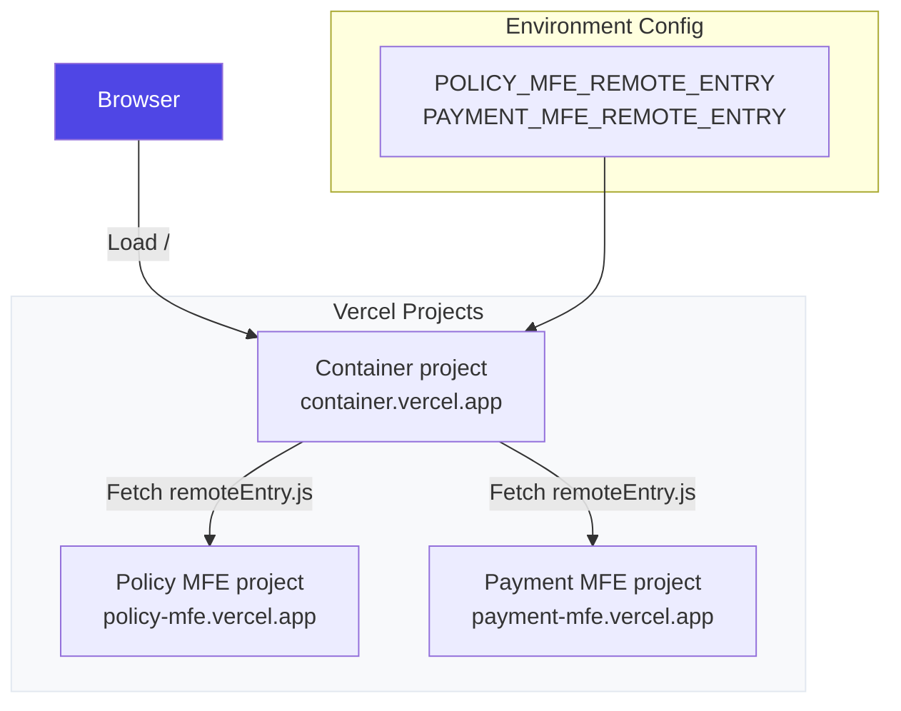

For production:
- Each MFE is built independently (`ng build --configuration=production`)
- Each app is deployed as a separate Vercel project with its own root directory
- Deploy `policy-mfe` and `payment-mfe` first, then deploy the container app from `container-app/`
- Container remote entry URLs are configured via `POLICY_MFE_REMOTE_ENTRY` and `PAYMENT_MFE_REMOTE_ENTRY`
- SPA rewrites are configured in each app's `vercel.json`
- Exact Vercel setup steps are documented in [VERCEL_DEPLOYMENT.md](./VERCEL_DEPLOYMENT.md)

### 15.3 Technology Stack Summary

| Layer | Technology | Version |
|-------|-----------|---------|
| Framework | Angular | 17 |
| Module Federation | `@angular-architects/module-federation` | 17 |
| Build Adapter | `ngx-build-plus` | 17 |
| Bundler | Webpack | 5 |
| CSS Pre-processor | SCSS | — |
| Icons | Material Icons Outlined | CDN |
| Font | Inter (Google Fonts) | CDN |
| State Persistence | localStorage | Browser API |
| Cross-MFE Events | CustomEvent | Browser API |
| Async Compute | Web Worker | Browser API |
| Package Manager | npm | 9+ |
| Runtime | Node.js | 18+ |

---

## 16. Future Enhancements

| Enhancement | Priority | Description |
|-------------|----------|-------------|
| **Backend Integration** | High | Replace localStorage with REST APIs for persistent server-side storage |
| **Authentication** | High | Add login flow with JWT; pass tokens via shared service |
| **Error Boundary Component** | Medium | Graceful fallback UI when remote MFE fails to load |
| **Claims MFE** | Medium | New remote MFE for insurance claim filing and tracking |
| **Shared npm Package** | Medium | Publish `@insurehub/shared` instead of copying files |
| **CI/CD Pipeline** | Medium | Independent build/deploy pipelines per MFE |
| **E2E Tests** | Low | Cypress or Playwright tests covering cross-MFE flows |
| **Cross-Tab Sync** | Low | Use `BroadcastChannel` API for multi-tab data consistency |
| **Dynamic Remote URLs** | Low | Load remote entry URLs from a manifest API instead of hardcoding |

---

*End of Document*
